Use the public **HCC1395/HCC1395BL matched pair** to develop a validated, reproducible somatic-variant pipeline.

Use:

- Tumor: HCC1395, `SRR7890844`
- Matched normal: HCC1395BL, `SRR7890845`
- Assay: paired-end WES
- Reference: GRCh38
- Validation: the published SEQC2 high-confidence somatic truth set and confident-region BED file

## Pipeline to demonstrate

```mermaid
flowchart LR
    A["Raw tumor and normal FASTQ"] --> B["FastQC and MultiQC"]
    B --> C["Adapter and quality cleanup"]
    C --> D["BWA-MEM3 alignment to GRCh38"]
    D --> E["Sort, index and mark duplicates"]
    E --> F["Alignment and coverage QC"]
    F --> G["Matched tumor-normal Mutect2"]
    G --> H["Contamination and artifact filtering"]
    H --> I["VEP functional annotation"]
    I --> J["Truth-set benchmarking"]
    J --> K["Figures, report and reproducible workflow"]
```



### 1. Raw-read cleanup

Use FastQC and MultiQC before and after cleanup. Show:

- Per-base quality
- Adapter content
- Read-length distribution
- Duplication
- GC distribution
- Number and percentage of retained reads

Use `fastp` or `cutadapt`, but explain every trimming choice. A strong analysis may conclude that aggressive quality trimming is unnecessary; demonstrating sound judgment is more valuable than trimming by default.

### 2. Sequence alignment

Use BWA-MEM3 with explicit read-group information, followed by sorting, indexing and duplicate marking.

Report:

- Total reads and mapped-read percentage
- Properly paired percentage
- Duplicate rate
- Mean target coverage
- Percentage of target bases at ≥20×, ≥50× and ≥100×
- Insert-size distribution
- Tumor-versus-normal coverage comparison

Tools could include BWA-MEM3, SAMtools, Picard and Mosdepth.

### 3. Somatic variant calling

Use GATK Mutect2 in matched-normal mode with:

- Tumor and matched-normal BAMs
- An assembly-compatible gnomAD germline resource
- A panel of normals, if available
- Contamination estimation
- Read-orientation artifact modeling
- `FilterMutectCalls`
- PASS-variant extraction and normalization

A matched normal gives Mutect2 evidence unavailable in tumor-only calling, particularly for separating rare germline variants and normal-sample artifacts. [Official Mutect2 documentation](https://gatk.broadinstitute.org/hc/en-us/articles/30332058799003)

### 4. Functional annotation

Use Ensembl VEP to add:

- Gene and transcript
- Variant consequence
- Protein and coding change
- Canonical transcript
- ClinVar association
- Population frequency
- SIFT, PolyPhen, CADD or AlphaMissense predictions
- Existing variant identifiers

VEP supports VCF input and can retain annotations in VCF or produce tabular/JSON results. [VEP documentation](https://www.ensembl.org/info/docs/tools/vep/index.html)

Create a concise prioritized table containing PASS variants that are:

- Protein-altering
- Rare or absent from population databases
- In recognized cancer genes
- ClinVar pathogenic or likely pathogenic
- Predicted damaging
- Supported by sufficient tumor depth and allele fraction

Be careful to label this as **functional annotation and prioritization**, not clinical interpretation.

### 5. Benchmarking

Compare your normalized PASS calls with the SEQC2 truth set, restricting evaluation to its high-confidence regions. Report separately for SNVs and indels:

- True positives
- False positives
- False negatives
- Precision
- Recall
- F1 score
- Performance by variant-allele-frequency band
- Performance by sequencing depth

Also inspect a few representative true positives, false positives and false negatives in IGV. Explain likely failure modes such as low allele fraction, mapping ambiguity, strand bias, insufficient normal coverage or indel representation.

## Repository deliverables

A hiring manager should be able to understand the project without downloading the raw data:

```text
cancer-ngs-pipeline/
├── README.md
├── workflow/
│   ├── main.nf                  # or Snakefile
│   └── modules/
├── config/
│   ├── samplesheet.csv
│   └── parameters.yaml
├── containers/
├── scripts/
├── results-summary/
│   ├── multiqc_report.html
│   ├── alignment_metrics.tsv
│   ├── variant_summary.tsv
│   ├── benchmark_metrics.tsv
│   └── figures/
├── docs/
│   ├── methods.md
│   ├── interpretation.md
│   └── limitations.md
└── environment.yml
```

Use Nextflow or Snakemake, pinned containers or environments, checksums for inputs, a sample sheet, documented software versions and a small test dataset. Do not commit FASTQs, BAMs, reference files or licensed annotation databases.

## Keep the initial scope disciplined

Focus on somatic SNVs and small indels.
